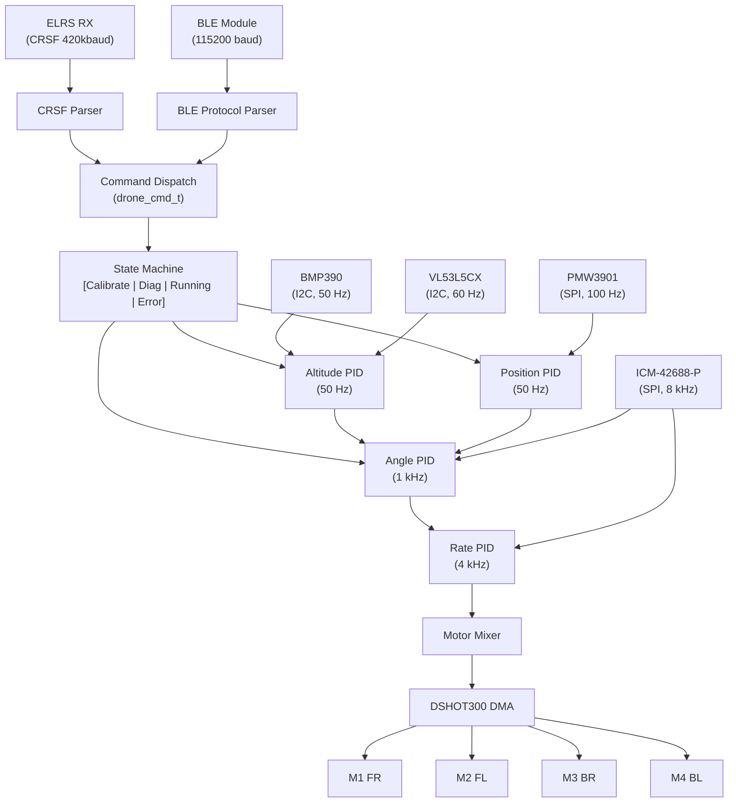
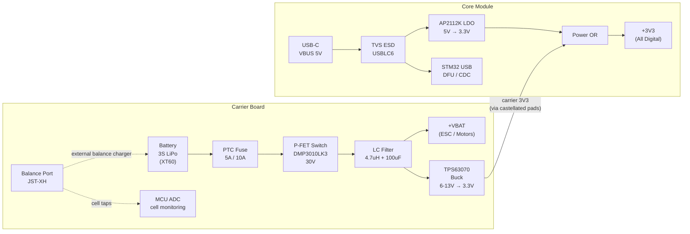
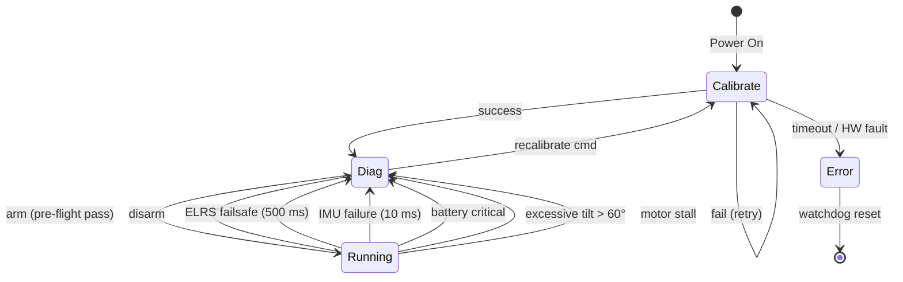
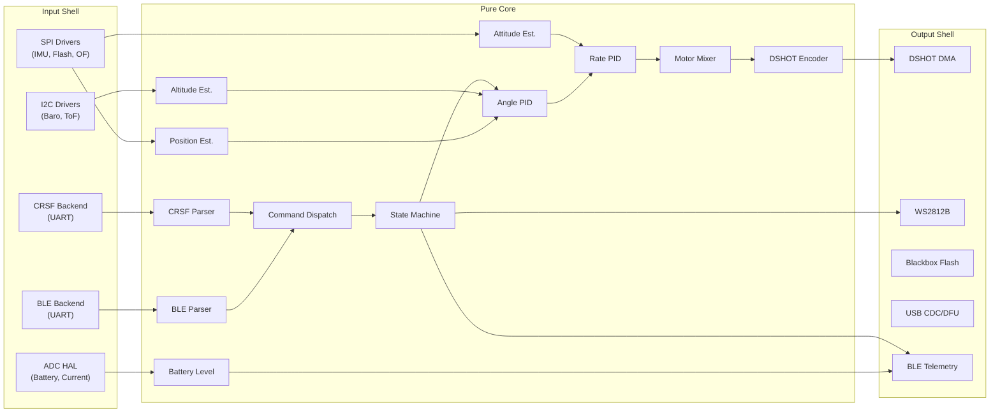

# miniDrone Gen 2 — Specification Summary

## At a Glance

| Parameter         | Value                                          |
|-------------------|------------------------------------------------|
| Frame             | Quadrotor X-config, 200 x 200 mm max (excl. props) |
| Battery           | 3S LiPo (CNHL MiniStar 850mAh 70C)           |
| Motors            | Brushless 1404 4500KV                         |
| Propellers        | 3 inch                                         |
| Flight Controller | STM32H743VIH6 (Cortex-M7, 480 MHz, FPU-DP)    |
| IMU               | ICM-42688-P (SPI, 32 kHz, on-PCB center)      |
| RC Link           | ExpressLRS 2.4 GHz (CRSF, 2-5 ms latency)     |
| Config Link       | BLE 5.0 (nRF52832 module, phone app)           |
| Architecture      | Core Module (40x25mm) + Carrier Board (50x50mm)|
| Connector         | Castellated pads, 1.27mm pitch, 2x30-pin per edge |
| FW Framework      | Zephyr RTOS                                    |

## Specifications

| Parameter              | Value           |
|------------------------|-----------------|
| Motor                  | 1404 / 4500 KV  |
| Battery                | CNHL 3S 850mAh 70C |
| Pack Voltage           | 9.0 - 12.6V    |
| AUW                    | 141 g           |
| Max Thrust             | 800 g           |
| Thrust / Weight        | 5.7 : 1         |
| Max Payload            | ~100 g (T/W 3.3:1) |
| Hover Time             | ~26 min         |
| Mixed Flight Time      | ~18 min         |
| Charging               | External balance charger |
| Optional Modules       | GPS (2.8g), Camera/VTX (4.5-7g) |

## Sensor Suite

| Sensor         | IC          | Bus  | Purpose                            |
|----------------|-------------|------|-------------------------------------|
| IMU            | ICM-42688-P | SPI1 | Attitude (accel + gyro)             |
| Barometer      | BMP390      | I2C1 | Altitude hold (> 2 m)              |
| Time-of-Flight | VL53L5CX    | I2C1 | Altitude hold (< 4 m)              |
| Optical Flow   | PMW3901     | SPI2 | Position hold                       |
| Pack ADC       | STM32 ADC1  | --   | Pack voltage (30K/10K divider)     |
| Cell ADC       | STM32 ADC1  | --   | Per-cell voltage via JST-XH balance port |
| Motor Current  | Shunt+OpAmp | ADC3 | Backup stall detect                 |
| Motor RPM      | DSHOT bidir | TIM1 | Per-motor eRPM via bidirectional DSHOT300 |

## Control Architecture

## Power Architecture

## State Machine

## Failsafe Summary

| Trigger               | Detection Time | Motor Action         |
|-----------------------|----------------|----------------------|
| ELRS link loss        | 500 ms         | Ramp down 200 ms     |
| IMU failure           | 10 ms          | Ramp down 200 ms     |
| Battery critical      | Per-cell < 3.3V| Ramp down 200 ms     |
| Battery cutoff        | Per-cell < 3.0V| Immediate off        |
| Excessive tilt > 60°  | Immediate      | Immediate off        |
| Motor stall/overcurrent| 100 ms        | Immediate off        |

## Gen 1 Issues — All Resolved

| #     | Issue                    | Gen 2 Resolution                         |
|-------|--------------------------|------------------------------------------|
| HW-01 | Missing gate pull-downs  | ESC handles gate drive                   |
| HW-02 | No reverse polarity      | P-FET (DMP3010LK3, 30V)                 |
| HW-03 | No overcurrent           | PTC fuse (5A hold / 10A trip)            |
| HW-04 | No LC filter             | 4.7 uH + 100 uF on battery input        |
| HW-05 | No gate resistors        | ESC handles internally                   |
| HW-06 | No ESD protection        | TVS on USB-C and SWD                     |
| HW-07 | DRC violations           | 4-layer PCB resolves routing/thermal     |
| HW-08 | IMU/BT power sequence    | Separate enable; 200 ms delay            |
| HW-09 | BOOT0 jumper usability   | USB-C DFU via button hold                |
| HW-10 | Cannot power off         | High-side P-FET clean cutoff             |
| HW-11 | Overweight (74 g)        | 52-83 g (config dependent, all flyable)  |
| HW-12 | BT/IMU EMI interference  | IMU at center, BLE at edge, GND plane    |
| HW-13 | LDO inefficient (45%)   | TPS63070 buck-boost on carrier board (88-93%) |

## Purity Boundary

## Verification Strategy

| Tool     | Target             | Properties                          |
|----------|--------------------|-------------------------------------|
| **TLA+** | State machine      | 13 safety + 4 liveness properties   |
| **CBMC** | Pure core C code   | 17 bounded model-check properties   |
| **Fuzz** | CRSF + BLE parsers | Buffer safety, termination          |
| **Ztest**| Full firmware      | 20 testable-only properties         |
| **HIL**  | Hardware-in-loop   | Timing, accuracy, end-to-end        |

## Key Design Decisions

1. **ELRS + BLE dual-link** — ELRS for low-latency flight; BLE for config/OTA. Independent.
2. **3S single config** — CNHL 850mAh 70C. Per-cell monitoring via JST-XH balance port.
3. **4-layer PCB** — GND plane fixes Gen 1 EMI; smaller board; ~$2-3 extra/board.
4. **Cascaded PID** — Angle (1 kHz) + rate (4 kHz), far better than Gen 1 single 500 Hz.
5. **Pure core / shell** — All flight math is deterministic, host-testable, formally verifiable.
6. **ICM-42688-P** — 10x lower noise than MPU6050, SPI, 32 kHz. MPU6050 is obsolete.
7. **TPS63070** — Buck regulator for 3S at ~89% efficiency; on carrier board.
8. **Modular core + carrier** — H743 dev module reusable for drones, robotics, and general embedded dev. Castellated pads for zero-weight production or socketed for development.
9. **Per-cell monitoring via JST-XH** — Standard balance connector enables per-cell ADC monitoring AND external balance charging. Imbalance detection refuses arm on damaged batteries.
10. **Bidirectional DSHOT300 + BlueJay** — Per-motor eRPM telemetry at 4 kHz. RPM-based stall detection, dynamic notch filtering, per-motor health monitoring.
11. **GPS + Camera removable** — JST-GH connectors for optional u-blox M10 GPS (2.8g) and HDZero/analog VTX (4.5-7g). Zero weight when not installed.

## Spec Documents

| Document                                    | Contents                                  |
|---------------------------------------------|-------------------------------------------|
| [features.md](features.md)                  | Modes, sensors, comms, UI, power, logging, OTA |
| [hardware.md](hardware.md)                  | MCU, all ICs, power system, PCB stackup   |
| [protocols.md](protocols.md)                | SPI, I2C, CRSF, BLE binary, DSHOT, USB, ADC |
| [performance.md](performance.md)            | Control loops, power budget, flight time, CPU load |
| [safety.md](safety.md)                      | Protection circuits, failsafe, EMI, ESD, thermal |
| [behavioral.md](behavioral.md)              | Invariants, mode contracts, startup, 50 edge cases |
| [mechanical.md](mechanical.md)              | Frame, motors, battery, weight, connectors |
| [remote_controller.md](remote_controller.md)| ELRS TX/RX, BLE GATT, OTA update flow     |
| [verification.md](verification.md)          | 35 provable + 20 testable properties, TLA+/CBMC/Fuzz |
